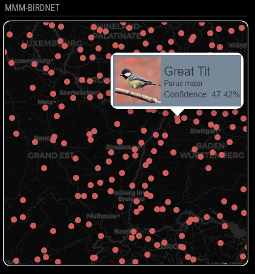

# MMM-BirdNET
This is a module for the [MagicMirror<sup>2</sup>](https://github.com/MichMich/MagicMirror) framework that displays the nearby submissions to the [BirdNET](https://birdnet.cornell.edu) repository at Cornell University. BirdNET is a research project that uses mobile apps and lightweight applications to listen for birdsongs and then matches them using a machine learning algorithm.



## Features
* Plots the uses of BirdNET mobile app in the nearby area
* Displays the name, species, photo, and confidence of a random submission via popup
* Several included map options
* Custom map option available
* Configurable speed of popups

## Dependencies
* An installation of MagicMirror<sup>2</sup>
* No addtional packages, all libraries are included.

## Installation
Clone the repository and add the config settings.
1. Clone the repository into your `~/MagicMirror/modules` folder.
2. Configure your `~/MagicMirror/config/config.js` file.
```
{
	module: "MMM-BirdNET",
	position: "bottom_left",
	config: {
		lat: 42.453583743,
		lon: -76.47363144,
	}
},
```
## Configuration Options
All configuration options are optional. There are no mandatory parameters.
| Option | Default | Description |
|:------:| ------- | ----------- |
| updateInterval | 3600000 (one hour) | How often the BirdNET data is pulled from the website.|
| popInterval | 30000 (30 seconds)| How often the popup switches to a new entry |
| dataUrl | https://birdnet.cornell.edu/map/requeststats| Where to pull the data |
| mapMode | 'dark' | Which map to use. Supported values are: `dark`, `light`, `atlas`, `stark`, `terrain`, `satellite`, `custom` and `metal`.
| lat | 42.453583743 | Latitude for the center of the map display. |
| lon | -76.47363144 | Longitude for the center of the map display. | 
| width | 400px | Width of the map box. |
| height | 400px | Height of the map box |
| zoomLevel | 7 | How far in the map is zoomed. See [Leaflet](https://leafletjs.com/examples/zoom-levels/) documentation for more details. |
| mapUrl | null | If you set the mapMode parameter to `custom`, this parameter will activate. You can supply your own [Leaflet](https://leafletjs.com/reference.html#map-example)-supported map URL here. |

## Upcoming Features
* Better CSS for the popups.
* Enable notification broadcasts

## Thanks To
* [thgmirror](https://forum.magicmirror.builders/user/thgmirror) over at the MagicMirror Forum for the inspiration.
* [cyberdie](https://forum.magicmirror.builders/user/cyberdie) for the idea about the bird images.